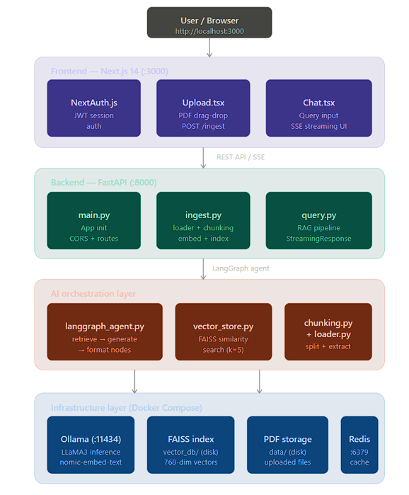
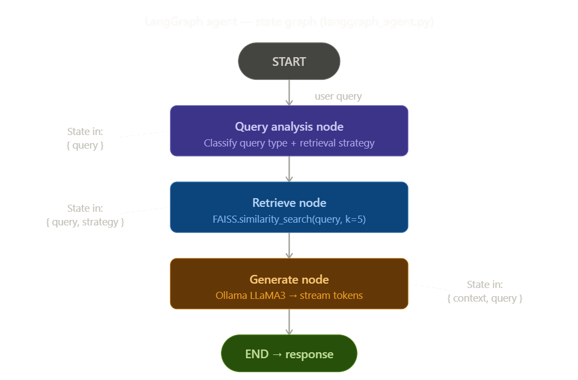
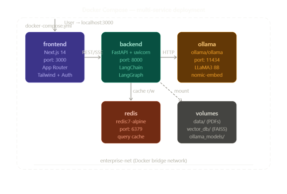
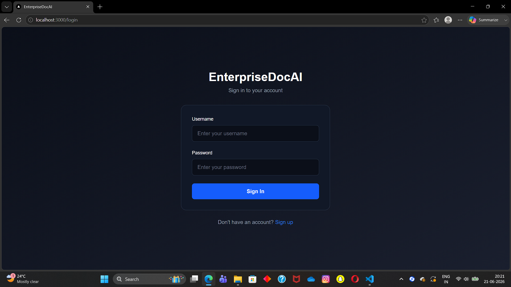
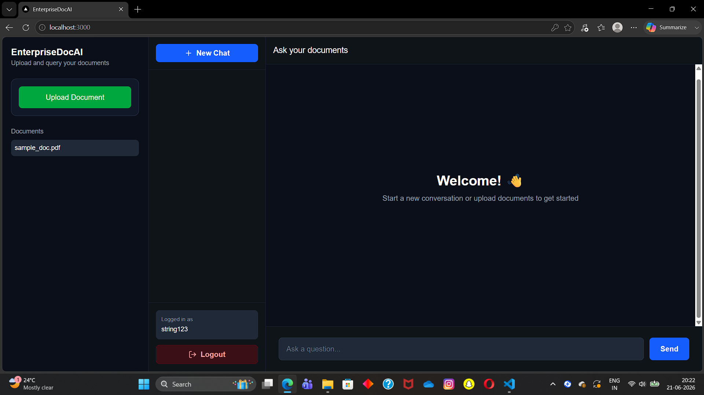
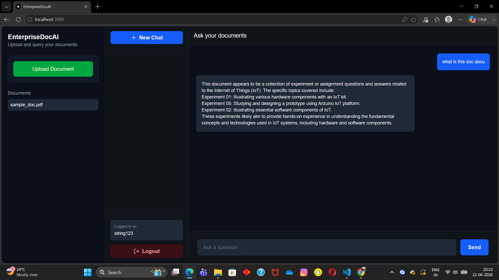

# 🚀 EnterpriseDocAI

> AI-Powered Enterprise Document Intelligence Platform built with FastAPI, Next.js, LangChain, LangGraph, Ollama, and Retrieval-Augmented Generation (RAG).

EnterpriseDocAI enables users to upload documents and interact with them using natural language. Instead of manually searching through lengthy PDFs, users can ask questions and receive context-aware answers generated from the uploaded documents.

---

# ✨ Key Features

* 🔐 Secure User Authentication
* 📄 PDF Document Upload & Management
* 🤖 AI-Powered Question Answering
* 🔍 Retrieval-Augmented Generation (RAG)
* 📚 Semantic Search using Vector Embeddings
* 💬 Interactive Chat Interface
* ⚡ FastAPI Backend APIs
* 🎨 Modern Next.js Frontend
* 🐳 Dockerized Deployment
* 🔄 LangGraph Agent Workflow

---

# 🏗️ System Architecture

The overall architecture of EnterpriseDocAI is shown below.



---

# 🔍 Retrieval-Augmented Generation (RAG) Pipeline

The system processes documents through chunking, embedding generation, vector storage, retrieval, and response generation.


---

# 🔄 LangGraph Agent Workflow

LangGraph is used to orchestrate intelligent document retrieval and response generation workflows.



---

# 🐳 Docker Deployment Architecture

The complete application is containerized using Docker and Docker Compose.



---

# 📸 Application Screenshots

## 🔐 Login Page



Users can securely access the platform using authentication.

---

## 📄 Dashboard & Document Upload



Upload and manage documents through a clean and intuitive interface.

---

## 💬 AI-Powered Document Chat



Ask questions about uploaded documents and receive context-aware responses powered by Retrieval-Augmented Generation (RAG).

---

# 🛠️ Technology Stack

## Frontend

* Next.js
* React
* TypeScript
* Tailwind CSS

## Backend

* FastAPI
* Python
* JWT Authentication

## AI & Machine Learning

* LangChain
* LangGraph
* Ollama
* Llama 3
* ChromaDB
* Sentence Transformers

## DevOps

* Docker
* Docker Compose
* Git
* GitHub

---

# ⚙️ Installation

## Clone Repository

```bash
git clone https://github.com/RishabhBaghel8959/Enterprise-Doc-AI.git

cd Enterprise-Doc-AI
```

## Backend Setup

```bash
cd backend

python -m venv venv

venv\Scripts\activate

pip install -r requirements.txt
```

## Frontend Setup

```bash
cd frontend

npm install

npm run dev
```

## Run Backend

```bash
uvicorn app.main:app --reload
```

---

# 🐳 Run with Docker

```bash
docker-compose up --build
```

---

# 🎯 Future Enhancements

* Multi-document conversations
* Chat history persistence
* Source citations for answers
* Multi-user workspaces
* Cloud deployment support
* Enterprise access control

---

# 👨‍💻 Author

**Rishabh Singh Baghel**

B.Tech – Computer Science & Engineering (AI & ML)

Passionate about Artificial Intelligence, Generative AI, Machine Learning, and Full-Stack Development.

🔗 GitHub: https://github.com/RishabhBaghel8959
